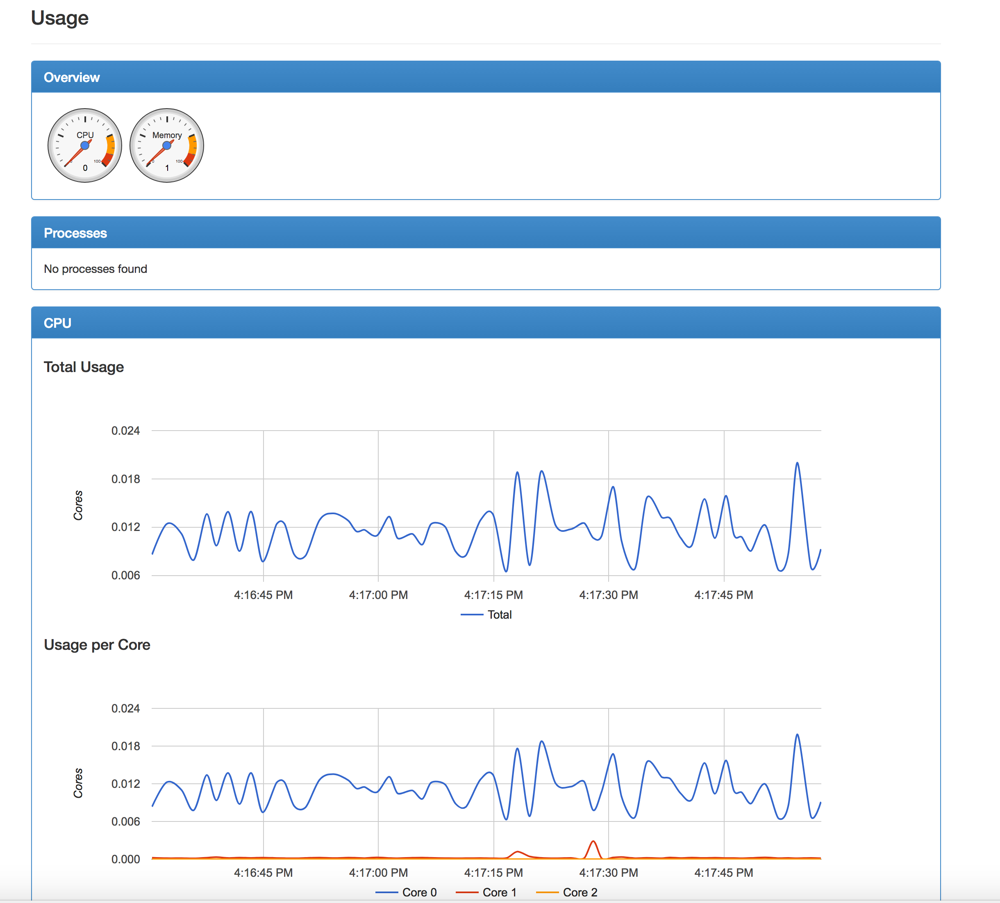

# funset-build
Contains docker files for dev and production builds of the FunSet project

### Requirements
* Docker (https://www.docker.com/)

### Installation in development
You need to build the docker image from the provided DockerFile and Docker Compose. To do this:

```bash
git clone --recursive https://github.com/MLHale/funset-builds.git
cd funset-builds
git submodule sync
git submodule update --init --recursive --remote
cd backend/
git checkout master
cd ../frontend/
git checkout master
cd ..
docker-compose build
docker-compose up -d
```

This creates a few docker containers with all of the requisite installed dependencies to run the dev environment. It also initializes the database and starts the containers.

### Setup an Admin user and compile C libraries
To create a new admin user for use in the admin portal do the following once the containers are up and running (i.e. `docker-compose up -d` has been run).

```bash
docker-compose exec django bash
python manage.py createsuperuser
# provide admin credentials
python loadterms.py -i ../../../GOUtildata/go.obo
cd ../../../GOUtil
g++ -O3 -o enrich enrich.C utilities.C --std=gnu++11
exit
```

### Running the backend in development
You can run the backend server using the following (executed from the build directory):

```bash
docker-compose up
```
Now visit `localhost` in your host browser to view the app.


### Development Environment Setup
If you plan to edit the client-side app, you need to,  upon initial install, build the ember dependencies. Do the following (on the host, from the `funset-builds/frontend/` folder):

* install npm 6.0.0+
* install ember-cli 2.16.2 +

Then:

```bash
npm install
```

### Running the client-side ember app in development
The following commands compiles and pushes the latest client code to the server (`localhost:4200`):

```bash
cd frontend
ember s
```

### Deploying the client-side app to production using surge
The client-side app should be served using a content deployment network (CDN). A good one is [surge](surge.sh).

To setup surge:
```bash
npm install --global surge
```


To deploy the client app to surge, do the following:

- open `frontend/config/environment`
- set `ENV.host` to be the url where your backend server is deployed
- save the file
- then do the following from within the `frontend` folder:

```bash
ember build -p
surge dist/
#specify the url to deploy to, surge will create a funny name for you by default, replace with your own domain name.
```
> Note that `surge dist/ <url>` shortcuts the need to type in the url.

### Updating to latest versions of of the code
To update to the latest frontend and backend codebases, simply do the following to update the provided submodules.

```bash
cd frontend
git pull
cd ../backend
git pull
```
or type:

```bash
git submodule update --remote
```

### Deployment for production
For deploying the server to AWS EC2 / Ubuntu 16.04 server:

- deploy a new amazon ec2 ubuntu 16.04 server instance using the AWS Console or set it up on a local server (e.g. on ESXi)
- install Docker and `docker-compose` on ubuntu 16.04
- do the following
```bash
git clone --recursive https://github.com/MLHale/funset-builds.git
cd funset-builds
docker-compose up --build -d
docker-compose exec django bash
../../../GOUtil g++ -O3 -o enrich enrich.C utilities.C --std=gnu++11
python manage.py createsuperuser
# provide admin credentials
python loadterms.py -i ../../../GOUtilData/go.obo
```

## Collaborating on this project
To prevent merge conflicts, always make sure you are working on a git branch. Read more about git branching here: https://git-scm.com/book/en/v2/Git-Branching-Basic-Branching-and-Merging
For an overview of useful git commands, visit: https://services.github.com/on-demand/downloads/github-git-cheat-sheet.pdf

To create a new branch in each repo, navigate to the parent directory:
```bash
cd <path to this project directory>
git pull
git branch <yourname>-<feature-name>
cd backend/
git pull
git branch <yourname>-<feature-name>
cd ../frontend/
git pull
git branch <yourname>-<feature-name>
```
It is good practice to name the branch using a combination of your name and the feature you are working on. For example ```git branch mlhale-userinterface``` might be an acceptable branch name.

### When to make a pull request
Once you have finished developing whatever feature you are working on, make a pull request. To make a pull request, use the github web or desktop interfaces to select where the pull request targets (usually the ```master``` branch).

Visit https://help.github.com/articles/about-pull-requests/ for more information.

## Monitoring containers
If desired, you can view the performance of containers using the google cAdvisor project (see https://github.com/google/cadvisor).

To run do the following:
```bash
docker pull google/cadvisor:latest
sudo docker run \
  --volume=/:/rootfs:ro \
  --volume=/var/run:/var/run:rw \
  --volume=/sys:/sys:ro \
  --volume=/var/lib/docker/:/var/lib/docker:ro \
  --publish=8080:8080 \
  --detach=true \
  --name=cadvisor \
  google/cadvisor:latest
```

Now visit ```localhost:8080``` or ```<ip>:8080``` to view the current performance. You should see monitoring tools that resemble:



## License
Funset is a web-based BIOI tool for visualizing genetic pathway information.
Copyright (C) 2017  Matthew L. Hale, Dario Ghersi, Ishwor Thapa

This program is free software: you can redistribute it and/or modify
it under the terms of the GNU General Public License as published by
the Free Software Foundation, either version 3 of the License, or
(at your option) any later version.

This program is distributed in the hope that it will be useful,
but WITHOUT ANY WARRANTY; without even the implied warranty of
MERCHANTABILITY or FITNESS FOR A PARTICULAR PURPOSE.  See the
GNU General Public License for more details.

You should have received a copy of the GNU General Public License
along with this program.  If not, see <http://www.gnu.org/licenses/>.
